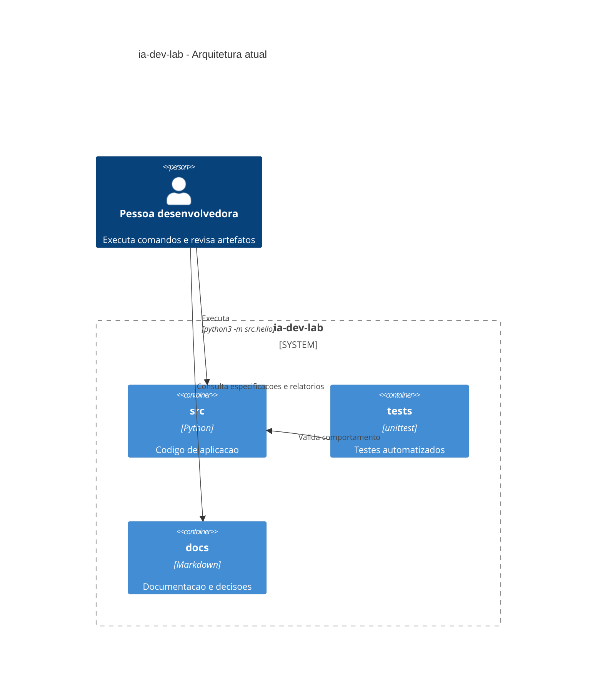
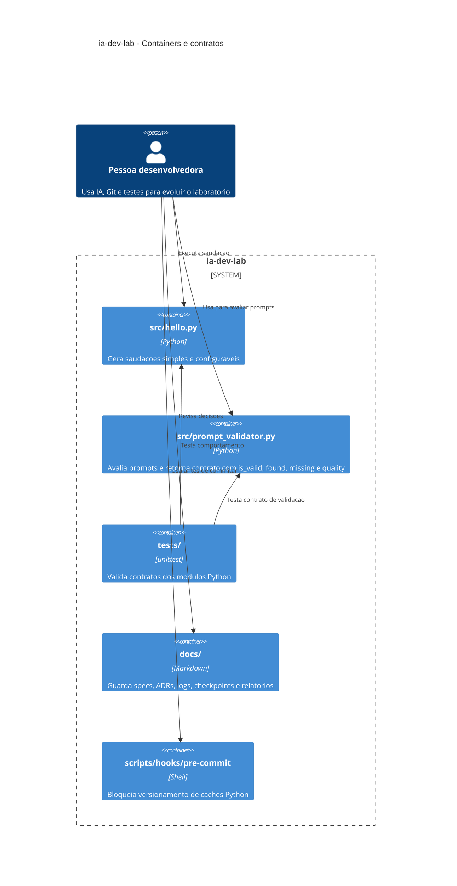

# Diagramas de arquitetura

## Versao 1: gerada com prompt simples

## Versao 2: ajustada manualmente com mais contexto

## Comparacao

A primeira versao comunica a divisao geral entre codigo, testes e documentacao, mas agrupa todo o codigo em um unico container `src`, escondendo os contratos dos modulos. A segunda versao comunica melhor a arquitetura atual porque mostra os modulos reais, o hook de harness e o contrato principal do validador de prompts. Para este projeto, a segunda versao e mais util em revisoes porque ajuda a localizar responsabilidades e pontos de acoplamento.
